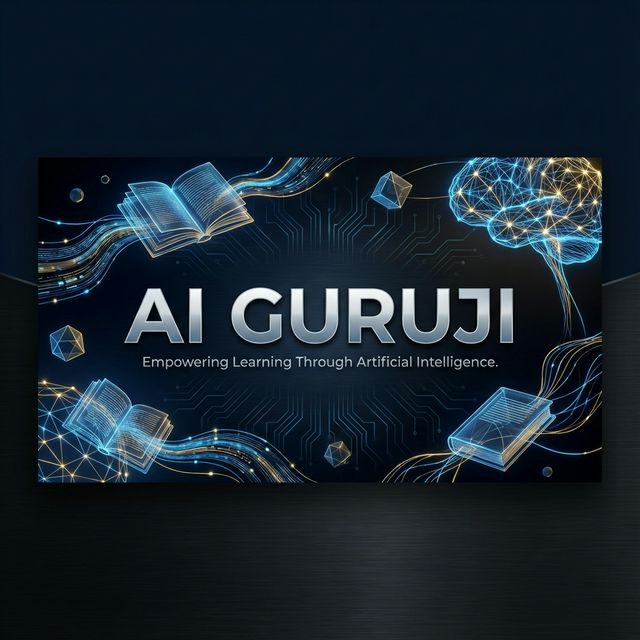

<div align="center">

# 🎓 AI Guruji
### *The Next-Gen AI Teacher System*



[](https://www.python.org/)
[](https://fastapi.tiangolo.com/)
[](https://reactjs.org/)
[](https://tailwindcss.com/)
[](LICENSE)

*Turn static PDFs into dynamic, engaging video lectures with a virtual AI professor.*

<!-- [View Demo](#) • [Report Bug](#) • [Request Feature](#) -->

</div>

---

## 📖 Overview

**AI Guruji** transforms the way we learn from documents. By leveraging cutting-edge LLMs, RAG pipelines, and digital avatar synthesis, it converts standard textbooks and research papers into **professional long-form video lectures**.

Imagine uploading a complex physics paper and having a virtual professor explain it to you with perfect slides, pacing, and voice—that's AI Guruji.

## ✨ Key Features

| Feature | Description |
| :--- | :--- |
| **PDF to Lecture** | Upload any PDF; the system parses, understands, and structures a lecture around it. |
| **Intelligent RAG** | **Retrieval-Augmented Generation** ensures every word spoken is factually grounded in your source text. |
| **Pro Narration** | Calm, paced, and realistic voice synthesis using **Coqui TTS**. |
| **Dynamic Slides** | Automatically generates beautiful HTML/CSS slides via **Playwright**, synced perfectly to the script. |
| **Virtual Avatar** | A lifelike **Wav2Lip** avatar that speaks your content, creating a connection just like a real teacher. |
| **Smart Player** | A custom **React** Orchestrator that handles the complex sync between video, slides, and audio. |

---

## 🏗️ Architecture

<div align="center">
  
</div>

<br>

## 🛠️ Tech Stack

### Backend
*   **Core**: `FastAPI` (Python)
*   **LLM**: `Google Gemini Pro`
*   **RAG Engine**: `FAISS` + `SentenceTransformers`
*   **Audio**: `Coqui TTS`
*   **Visuals**: `Wav2Lip` (Lip Sync), `Playwright` (Slide Rendering)

### Frontend
*   **Framework**: `React` (Vite)
*   **Styling**: `Tailwind CSS`
*   **UI/UX**: `Glassmorphism`, `Lucide Icons`

---

## Getting Started

Ready to build your own AI Teacher? Follow these steps. For a deep dive, check the [**Setup Guide**](README_SETUP.md).

### Configuration
Rename the environment file:
```bash
mv backend/.env.example backend/.env
# Add your GEMINI_API_KEY in the file
```

### Backend Setup
```bash
cd backend
pip install -r requirements.txt
uvicorn app.main:app --reload
```

### Frontend Setup
```bash
cd frontend
npm install
npm run dev
```

---

## Project Structure

```bash
AI_Guruji/
├── 📂 backend/
│   ├── 📂 app/
│   │   ├── 📂 api/          # 🔌 Endpoints (Upload, Generate)
│   │   ├── 📂 services/     # ⚙️ Core Logic (RAG, TTS, Slides)
│   │   └── 📂 core/         # 🧠 Prompts & Config
│   └── 📂 data/             # 💾 Stores output media & vector DBs
├── 📂 frontend/
│   ├── 📂 src/
│   │   ├── 📂 components/   # 🧩 Player & UI Components
│   │   └── ⚛️ App.jsx       # 📱 Main Application
└── 📜 implementation_plan.md
```

## ⚠️ Important Notes

> **Avatar Generation**: High-quality lip-sync requires a GPU and `wav2lip_gan.pth` weights. Please verify your hardware capabilities in [**README_AVATAR.md**](README_AVATAR.md).

> **Time Synchronization**: The system is designed to auto-calculate audio durations to ensure slides transition at the exact right moment.

---

<div align="center">

## 📜 License
This project is protected under the **MIT License**. View the [LICENSE](LICENSE) file for more information.

<br>

Made with ❤️ by the **AI Guruji Team (lead by Kaushal Jindal)**

</div>
